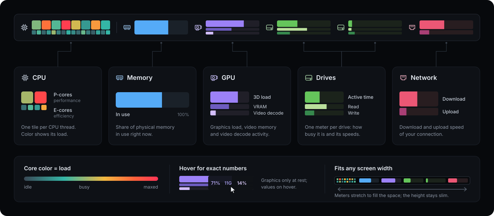

# Loadbar

**A compact desktop system monitor designed for low CPU usage and a small RAM footprint.**

Loadbar shows per-core CPU activity, RAM, GPU, every physical disk, and network traffic in
one native Windows bar. Place it along any edge of your chosen monitor. It reserves desktop
space so ordinary maximized windows fit beside it; hover to reveal the numbers.


*Illustration at 60 DIPs using synthetic readings.*

Built in native C++, Loadbar samples once per second by default and redraws when readings
or window state change. It reuses resources and keeps current readings rather than a growing
history. No browser engine or background service. See the [performance evidence](docs/performance.md);
controlled CPU and RAM measurements for this version remain pending.

## What it shows



| Widget | Readings |
| --- | --- |
| CPU | One colored tile per logical processor, with physical-core relationships in details |
| RAM | Physical memory used, plus used/total GB on hover |
| GPU | Separate 3D activity, video decode, and GPU memory |
| Disks | Every discovered physical disk, with active time and separate read/write rates |
| Network | Download and upload on the selected interface, including local-network traffic |

Percentage meters use 0–100%. Each disk/network rate direction scales to its highest valid
reading since launch. Failed samples retain their last valid display; raw status and
observation age remain available in details.

## Run Loadbar

**Requires Windows 11 x64.** Download **[Loadbar 1.1.1](https://github.com/Vorta/Loadbar/releases/tag/v1.1.1)**.
See the [release notes](docs/releases/1.1.1.md) for details and validation status.

1. Run `Loadbar.exe`. Its notification-area icon may be in the overflow menu.
2. Click the icon for **Settings**. Choose the monitor, edge, GPU and network interface.
   Hide GPU or Network, or uncheck individual drives, to give the remaining widgets more space.
   New drives are shown automatically. Allow a few samples for counters to warm up.
3. Hover for readings and device details. Left-click the bar to open Task Manager;
   right-click for the menu.
4. Choose **Exit** in the tray/bar menu or **Exit Loadbar** in Settings to release the
   reserved space. Closing Settings normally leaves Loadbar running.

Adjust thickness from **40–640 DIPs**, alignment, and sampling from **250–5,000 ms**.
Loadbar increases thickness when needed to keep every widget readable. Settings is
keyboard-accessible; use `Win+B` to reach the tray. Preferences are saved per user in
`HKCU\Software\Loadbar`. Samples and session peaks are never saved. Loadbar does not
register itself to start with Windows.

## Build from source

Use PowerShell 7 and the [tested Windows toolchain](docs/toolchain.md). From the repository root:

```powershell
. .\scripts\enter-dev-shell.ps1
cmake --preset windows-x64-release
cmake --build --preset windows-x64-release
ctest --preset windows-x64-release --output-on-failure
```

The application is a single executable at `out\build\windows-x64-release\Loadbar.exe`.
Launch it with:

```powershell
Start-Process .\out\build\windows-x64-release\Loadbar.exe
```

See [testing](docs/testing.md) for Debug, ASan and analysis commands, or
[CONTRIBUTING.md](CONTRIBUTING.md) to contribute. Metric sources and limitations are in
[docs/metrics.md](docs/metrics.md).

Copyright © 2026 **Vorta**. Released under the [MIT license](LICENSE).
